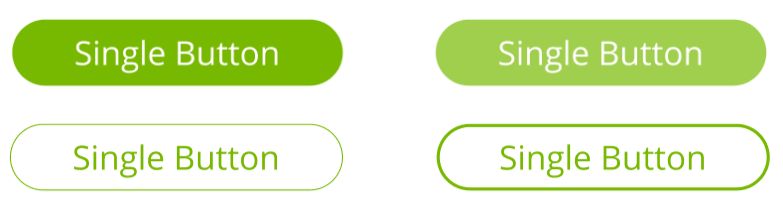

[Main page](../../README.md) / [Design](./design.md) / Components /..

---

## Button

The Button component is designed to display a customizable button with text, style, and behavior:

This component has five properties:
- `text` (Required): A string that represents the text displayed on the button;
- `onClick` (Required): A callback function that is triggered when the button is clicked;
- `variant`: A string that determines the button style, either 'contained' or 'outlined' (default is 'contained');
- `disabled`: A boolean that indicates whether the button is disabled and cannot be interacted with;
- `startIcon`: A React node representing an icon to be displayed at the start of the button;
- `textTransform`: A string controlling the text transformation, with options 'none', 'uppercase', 'lowercase', or 'capitalize';
- `fontSize`: A string specifying the font size of the button text.
- `color`: A string that sets the color of the button. It is optional.

### API

```ts
type ButtonType = {
  text: string;
  onClick: () => void;
  variant?: 'contained' | 'outlined';
  disabled?: boolean;
  startIcon?: React.ReactNode;
  textTransform?: 'none' | 'uppercase' | 'lowercase' | 'capitalize';
  fontSize?: string;
  color?: string;
};
```

In component:

```tsx
return <Button disabled={!password.trim()} text={t('common.button.next')} onClick={handleNext} />
```

### Examples

#### Button


